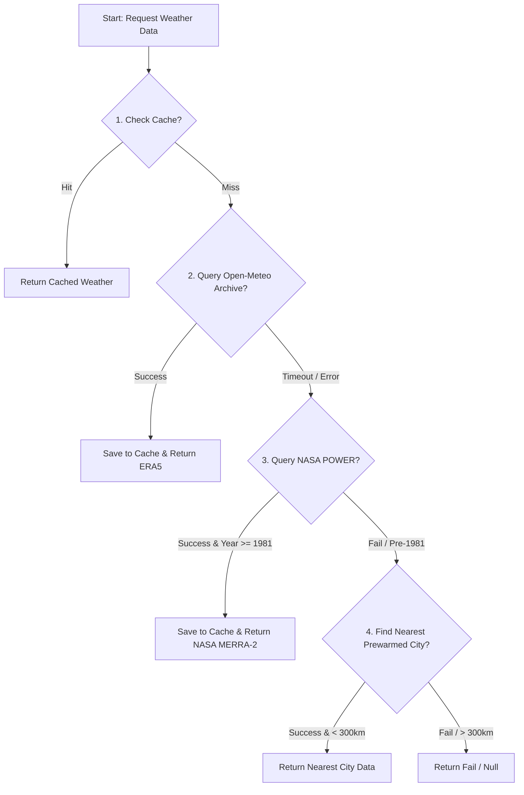

# Weather and Climate Data Sourcing Hierarchy

This document outlines the priorities, sources, and fallback logic used in the Klimate Kundli backend to resolve historical weather records, peak temperature spikes, and global climate metrics.

---

## 1. Daily Historical Weather (Temperature & Rainfall)

The resolver responsible for fetching daily historical weather records (e.g., for calculating monthly climate changes, lived city rainfall profiles, and spans) is defined in [historical.ts](file:///Users/arko/Documents/CODE/klimate-kundli/src/resolvers/historical.ts). 

It uses the following sequential sourcing hierarchy:

### Detailed Sourcing Layers

1. **SQLite Cache (Tiers `hist:raw:v2` / `hist:raw:v1`)**
   - **Type**: On-disk database caching (`data/cache.sqlite`).
   - **Key Format**: `hist:raw:v2:{lat,lon grid cell}:{startYear}:{endYear}`.
   - **Action**: Fast retrieval of previously fetched ranges.

2. **Open-Meteo Archive API (ERA5 Reanalysis)**
   - **Source**: Copernicus ERA5 & ERA5-Land gridded climate records (global, 1940 $\to$ present).
   - **Request**: Queried via `https://archive-api.open-meteo.com/v1/archive` using `models=era5_seamless`.
   - **Metadata Tag**: `source: "era5_seamless"`, `confidence: "high"`.

3. **NASA POWER API (MERRA-2 Reanalysis)**
   - **Source**: NASA Prediction of Worldwide Energy Resources (covers 1981-01-01 $\to$ present).
   - **Fallback Condition**: Queried only if Open-Meteo fails/times out, and the requested start date is on or after `1981-01-01`.
   - **Metadata Tag**: `source: "nasa_power"`, `confidence: "high"`.

4. **Nearest Prewarmed City**
   - **Source**: Pre-calculated daily weather from a static list of representative cities (`src/data/prewarm_cities.json`).
   - **Fallback Condition**: Used if both APIs fail, or the requested range predates NASA's 1981 floor.
   - **Limits**: Must be within **300 km** of the target coordinates (Haversine formula).
   - **Metadata Tag**: `source: "nearest_city"`.
     - Distance $\le 100\text{ km}$: `confidence: "medium"`.
     - Distance $100\text{--}300\text{ km}$: `confidence: "low"`, tagged with `reason: "nearest-city-Xkm"`.

---

## 2. Indian Peak Temperature Overrides (IMD Station Data)

While general daily timeline averages use global gridded reanalysis, local temperature spikes (peak record-hot years) inside India are overridden using official Indian Meteorological Department (IMD) station data for better scientific accuracy.

This logic is configured in the `/monthly-delta` route handler [monthly-delta.ts](file:///Users/arko/Documents/CODE/klimate-kundli/src/routes/monthly-delta.ts) via `applyImdPeak()`:

1. **Country Verification**: The city must be in India (`city.country === "IN"`), and the backend `ImdService` must be enabled.
2. **Station Binding**: Maps the city's coordinates to the nearest IMD monitoring station using the offline static station map (`src/data/imd_station_map.json`).
3. **Peak Querying**: Looks up the annual peak temperature for that station and year (offline cached peaks in SQLite `imd:peak:v1:{stationId}:{year}`).
4. **Override**: If the peak exists, it overrides the daily maximum peak (`peakTempC`) for that year:
   - **Metadata Tags**:
     - `peakSource: "imd_station"`
     - `imdStationName: "STATION_NAME"`
     - `imdDistanceKm: X` (rounded distance in kilometers)
5. **Gridded Fallback**: If the IMD station mapping or SQLite record is missing, it falls back to the original ERA5 grid maximum, tagging the metadata as `peakSource: "era5_grid"`.

---

## 3. Global Context & Carbon Emissions

Other planetary climate metrics are sourced from curated, offline static files refreshed annually (`npm run fetch:static`):

* **Carbon Emissions**: Sourced from the Global Carbon Project / Our World in Data (OWID) static databases. Used to populate the `IndiaEmissionsRings` arrays.
* **Atmospheric $\text{CO}_2$ concentration**: Sourced from NOAA Mauna Loa monthly mean flask samples. Linear interpolation is used inside the frontend client for intermediate historical years.
* **Arctic Sea Ice Extent**: Sourced from the National Snow and Ice Data Center (NSIDC) September minimums (5-year rolling averages).
* **Sea Level Rise**: Sourced from NOAA Laboratory for Satellite Altimetry.
