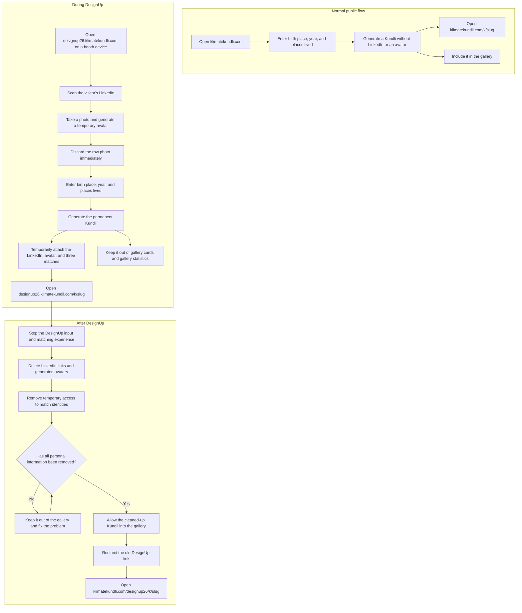

# DesignUp 2026 flow

## URL decision

During the conference, the booth devices will use:

`designup26.klimatekundli.com`

After the conference, the permanent DesignUp pages will live at:

`klimatekundli.com/designup26`

For example:

```text
During DesignUp:
designup26.klimatekundli.com/k/abc123

After DesignUp:
klimatekundli.com/designup26/k/abc123
```

We prefer a subdomain for the live event because the DesignUp version temporarily
handles LinkedIn links, avatars, camera access, and booth sessions. Keeping it on a
separate subdomain helps keep the event experience apart from the normal public site.
It also lets us redirect the whole event site after the conference is over.

The permanent, cleaned-up Kundlis will live on the main Klimate Kundli site because
that is the long-term home of the project.

## The three flows



## Important rule

The permanent Kundli and the temporary DesignUp information should be kept separate.
The permanent Kundli contains the climate information. The temporary event information
contains the LinkedIn link, generated avatar, and identities of the three matches.

The raw photo is never stored. After DesignUp, the temporary event information is
deleted. Only after that deletion has been checked should the Kundli appear in the
gallery or redirect to its permanent page.

The old event links must continue to work. Once cleanup is complete, they should
permanently redirect like this:

```text
designup26.klimatekundli.com/k/abc123
→ klimatekundli.com/designup26/k/abc123
```

The event homepage should also redirect:

```text
designup26.klimatekundli.com
→ klimatekundli.com/designup26
```
